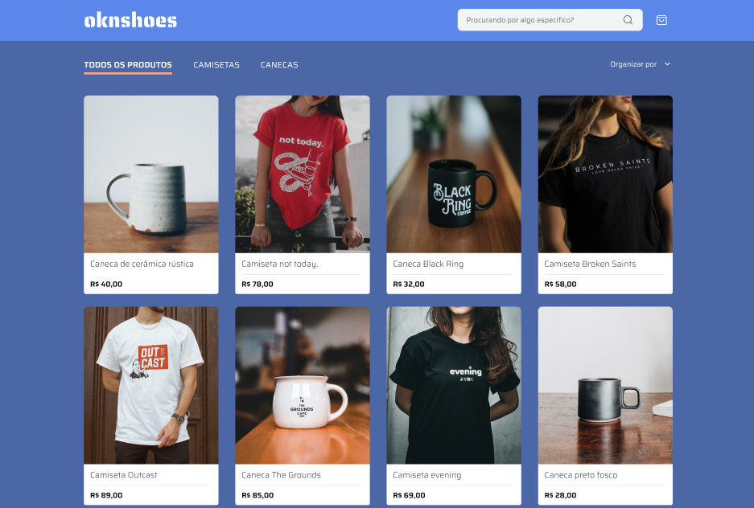

🚀 Bem-vindo(a). Este é o desafio Front end da OKN!

O objetivo deste desafio é entender suas habilidades de desenvolvimento front-end. Quando terminar, basta responder ao e-mail que recebeu com o link do seu repositório aqui no GitHub. Depois disso, daremos o feedback e passaremos para os próximos passos. Boa sorte! 🚀

⚠️ Lembre-se de deixar seu repositório público para que possamos analisar sua solução sem problemas. 😉

🧠 Contexto

O desafio será implementar um e-commerce que deverá ter as seguintes funcionalidades:

-Catálogo de produtos com paginação
-Filtragem produtos por categoria
-Busca por nome do produto

 📋 Instruções
 - Pode utilizar Next.Js ou criar o HTML, CSS, JS puro.
 - CSS deve ser feito com SASS
 - Siga esse [FIGMA](https://www.figma.com/design/JYngG6jj9RVIAI57RQoMxa/oknshoes?m=auto&t=AYKDALOPvtdYNA6w-6)
 - Para consumir a api, rode o comando npm i, npm start
 - Por favor, inclua no README as instruções de instalação do projeto
 

✔️ Critérios de Avaliação
- Integração com a API
- Componentização e reutilização de código
- Design responsivo e adaptável
- Foco em usabilidade e experiência do usuário
- Atenção à acessibilidade e boas práticas
- Organização e padrão nos commits (Conventional Commits)

😎 Serial legal
- Fazer deploy na vercel ou em outro local de sua preferência e disponibilizar um link de visualização.
- Utilização de cache do Next.js

🦝 Depois que tudo estiver pronto, envie o link do repositório e o link do projeto online, caso tenha feito o deploy, para:
tiago@okn.com.br

🚀Sim, o layout foi inspirado no capputeeno da rocket